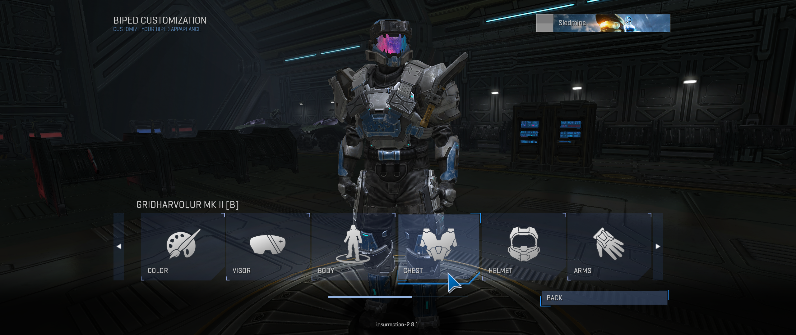

<html>
    <p align="center">
        
    </p>
</html>

---

Insurrection is a project for Halo Custom Edition that aims to bring a modern UI
with support for a full widescreen menu, a variety of in game customizations for other mods, some
features such as bookmarking reconnect from the menu, editing extra game configurations, message of
the day with important news to players and the most important, provides a new multiplayer experience
as service to play with friends in any map anytime whenever you want for free.

# Getting Insurrection
Get the latest version available using [Mercury](https://github.com/Sledmine/Mercury)
with the following line on the terminal:
```
mercury install insurrection
```

This mod uses [Chimera](https://github.com/SnowyMouse/chimera) as it works as a loader for other 
binary mods as [Balltze](https://github.com/MangoFizz/balltze).

# Screenshots

We are aiming for high resolution assets as possible, this includes fonts now thanks to Chimera we
can override fonts with higher resolution ones, by now Chimera only provides one way to override
fonts globally and not per map or per font, that would be a feature to request.
Simply replace the font_override ini block on your config with one from this repository.

A high resolution mouse bitmap was added, more ui widget components were moved to support a real
widescreen layout.




