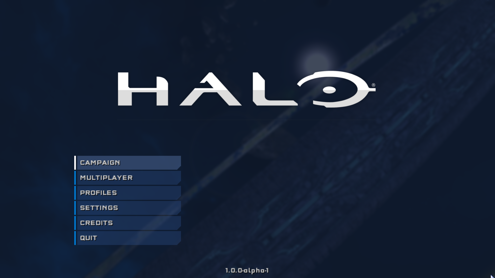

# Insurrection 1.0.0-alpha-1
Insurrection is a UI project for Halo Custom Edition that aims to bring support for a full
widescreen menu with different features for the Halo Custom Edition game, such as bookmarking
servers in game, handling different game configurations, bringing important news to players and more.

# Getting Insurrection
The project can be downloaded using [Mercury](https://github.com/Sledmine) with the following
line on the terminal:
```
mercury install insurrection
```
**NOTE:** This project has [Harmony](https://github.com/JerryBrick/harmony) as a dependency, it is
used to force a different aspect ration of the UI, setting it to 16:9.

# Screenshots


