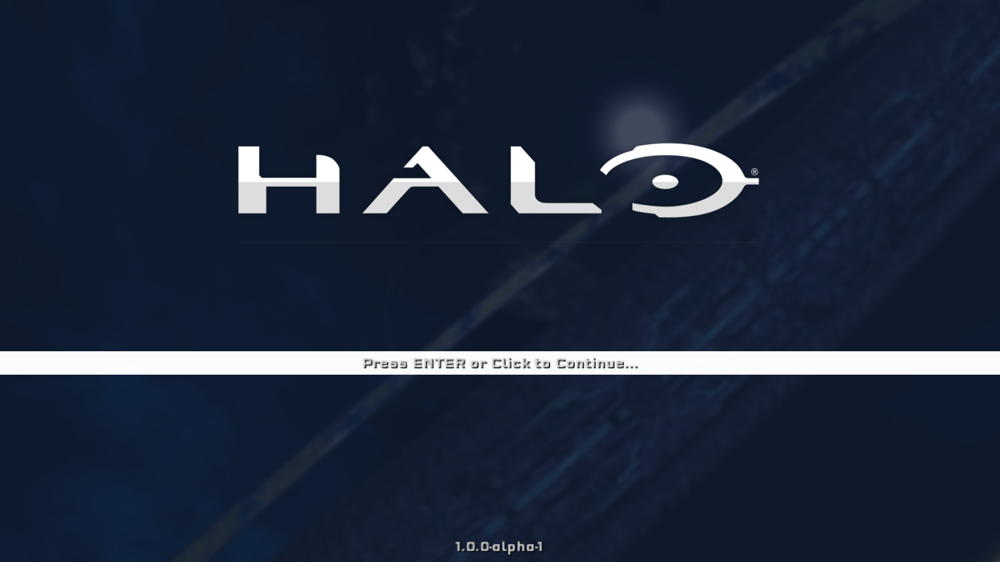
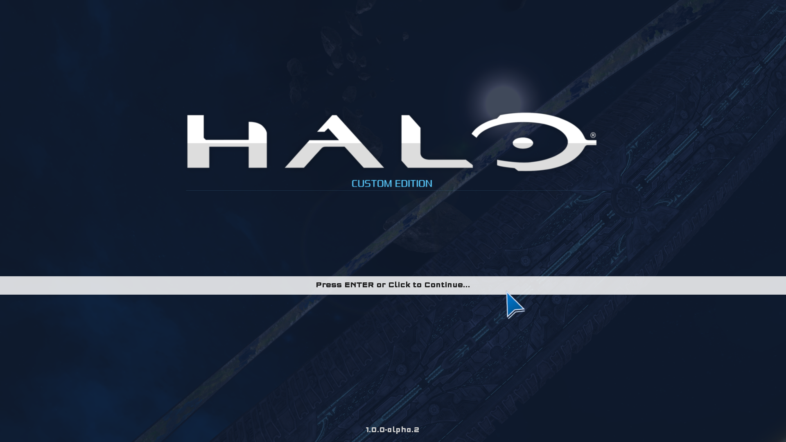
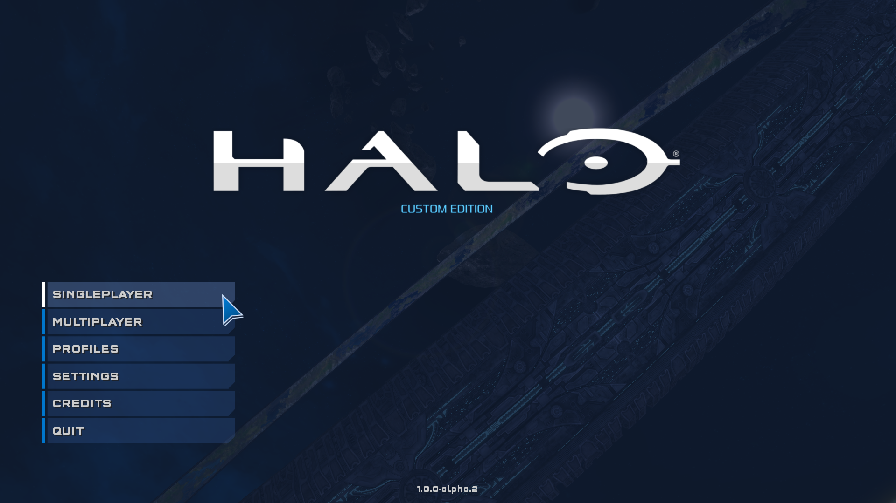

# Insurrection (v1.0.0-alpha.1)
Insurrection is a UI project for Halo Custom Edition that aims to bring support for a full
widescreen menu with different features for the Halo Custom Edition game, such as bookmarking
servers in game, handling different game configurations, bringing important news to players and more.

# Getting Insurrection
Version `1.0.0-alpha.1` project can be downloaded using [Mercury](https://github.com/Sledmine/Mercury) with
the following
line on the terminal:
```
mercury install insurrection
```
**NOTE:** This project has [Harmony](https://github.com/JerryBrick/harmony) as a dependency, it is
used to force a different aspect ration of the UI, setting it to 16:9.

It also uses [Chimera](https://github.com/SnowyMouse/chimera) as it is a loader for other 
binary mods as [Harmony](https://github.com/JerryBrick/harmony), lua scripting is another function
being used from this.

# 1.0.0-alpha.1 - Screenshots



# Coming in 1.0.0-alpha.2 - Screenshots

We are aiming for high resolution assets as possible, this includes fonts now thanks to Chimera we
can override fonts with higher resolution ones, by now Chimera only provides one way to override
fonts globally and not per map or per font, that would be a feature to request.

Blur on menus was removed, there is some discussion about keeping it or removing it.

A high resolution mouse bitmap was added, more ui widget components were moved to support real
widescreen layout.


